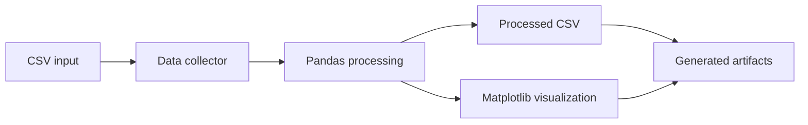

# Automated Data Pipeline with CI/CD

A small, inspectable data-engineering showcase that turns a CSV input into processed data and a generated visualization, then runs the same workflow inside Docker and GitHub Actions.

> **Scope:** portfolio/demo pipeline. The goal is to demonstrate reproducible processing and CI automation, not to imitate a large production data platform.

## Pipeline



The code is deliberately split into small stages:

- `data_collector.py` — reads source data;
- `data_processor.py` — aggregates/transforms the dataset;
- `visualizer.py` — produces a chart.

## Tech stack

- Python
- Pandas
- Matplotlib
- Docker
- Docker Compose
- GitHub Actions

## Quick start

```bash
git clone https://github.com/theDAREK497/data-pipeline-ci-cd.git
cd data-pipeline-ci-cd
```

Place or update the input file at:

```text
data/sales_data.csv
```

Example:

```csv
category,sales
electronics,1000
clothing,800
books,500
```

Run the containerized pipeline:

```bash
docker compose up --build
```

Generated outputs are written back to the project data/docs locations used by the pipeline.

## CI workflow

The repository includes:

```text
.github/workflows/ci-cd.yml
```

On pushes to `main`, GitHub Actions checks out the repository and runs the pipeline through Docker Compose.

That makes the processing flow reproducible between a developer machine and CI.

## Repository structure

```text
.github/workflows/   CI workflow
data/                source and processed data
docs/                generated visualization/output
src/
  data_collector.py
  data_processor.py
  visualizer.py
Dockerfile
docker-compose.yml
requirements.txt
```

## What this demonstrates

- splitting a simple data job into focused stages;
- reproducible containerized execution;
- automated execution in CI;
- artifact generation from source data;
- a minimal base for adding validation or tests.

## Production considerations

A real data platform would usually add:

- data contracts/schema validation;
- unit and integration tests;
- persistent object/database storage;
- orchestration and scheduling;
- retry/idempotency strategy;
- data-quality checks;
- lineage and observability;
- environment-specific deployment.

Those concerns are intentionally outside the scope of this compact example.

## License

MIT. See [LICENSE](LICENSE).
