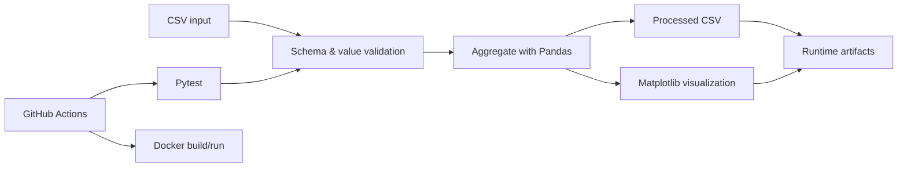

# Automated Data Pipeline with CI/CD

[](https://github.com/theDAREK497/data-pipeline-ci-cd/actions/workflows/ci-cd.yml)

A compact, inspectable data-engineering showcase that validates a CSV data contract, aggregates sales data, generates reproducible artifacts, and verifies the same workflow through automated tests, security checks, Docker, and GitHub Actions.

> **Scope:** portfolio/demo pipeline. The goal is to demonstrate reproducible processing and engineering discipline around a small data workflow, not to imitate a large production data platform.

## Pipeline



The implementation is split into focused stages:

- `data_collector.py` — loads the source CSV and enforces the input contract;
- `data_processor.py` — aggregates validated rows into category totals;
- `visualizer.py` — produces a headless PNG chart;
- `pipeline.py` — orchestrates the stages and writes runtime artifacts.

## Data contract

The source CSV must contain:

| Column | Requirement |
| --- | --- |
| `category` | non-null, non-blank text |
| `sales` | numeric, non-null, non-negative |

Invalid inputs fail with an explicit validation error before downstream processing starts.

## Quality and CI

Every push and pull request to `main` runs Ruff, Pytest, Bandit, `pip-audit`, a full pipeline smoke test, Docker image build, and Docker container execution. Dependabot monitors both Python packages and GitHub Actions.

## Local development

Python 3.13 is the reference runtime used by CI and Docker.

```bash
python -m venv .venv
python -m pip install -r requirements-dev.txt
```

On Windows systems where PowerShell script execution is restricted, activation is not required:

```powershell
.\.venv\Scripts\python.exe -m pip install -r requirements-dev.txt
.\.venv\Scripts\python.exe -m pytest
```

Run all local checks:

```bash
ruff check .
python -m pytest
bandit -q -r src
pip-audit -r requirements.txt
```

Run the pipeline:

```bash
python -m src.pipeline
```

Generated runtime outputs are written to the ignored `artifacts/` directory:

```text
artifacts/
  raw_data.csv
  processed_data.csv
  sales_plot.png
```

## Docker

```bash
docker build -t data-pipeline-ci-cd .
docker run --rm data-pipeline-ci-cd
```

To persist generated artifacts locally:

```bash
docker compose up --build
```

## Repository structure

```text
.github/
  dependabot.yml
  workflows/ci-cd.yml
data/sales_data.csv
src/
  __init__.py
  data_collector.py
  data_processor.py
  pipeline.py
  visualizer.py
tests/
  test_data_collector.py
  test_data_processor.py
  test_pipeline.py
Dockerfile
docker-compose.yml
pyproject.toml
requirements.txt
requirements-dev.txt
```

## Failure modes covered

The automated suite verifies missing required columns, non-numeric or negative sales values, missing/blank categories, deterministic aggregation, and complete end-to-end artifact generation.

## Production considerations

A production data platform would typically add persistent object/database storage, orchestration and scheduling, retry/idempotency policy, observability, lineage, environment-specific configuration, and richer data-quality rules. Those concerns are intentionally outside this repository's compact portfolio scope.

## License

MIT. See [LICENSE](LICENSE).
